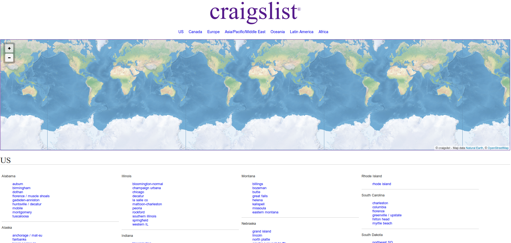
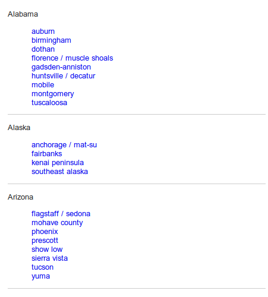
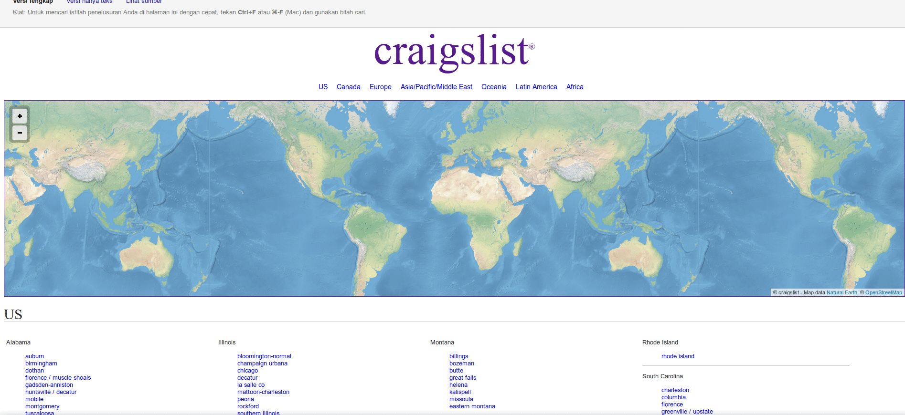
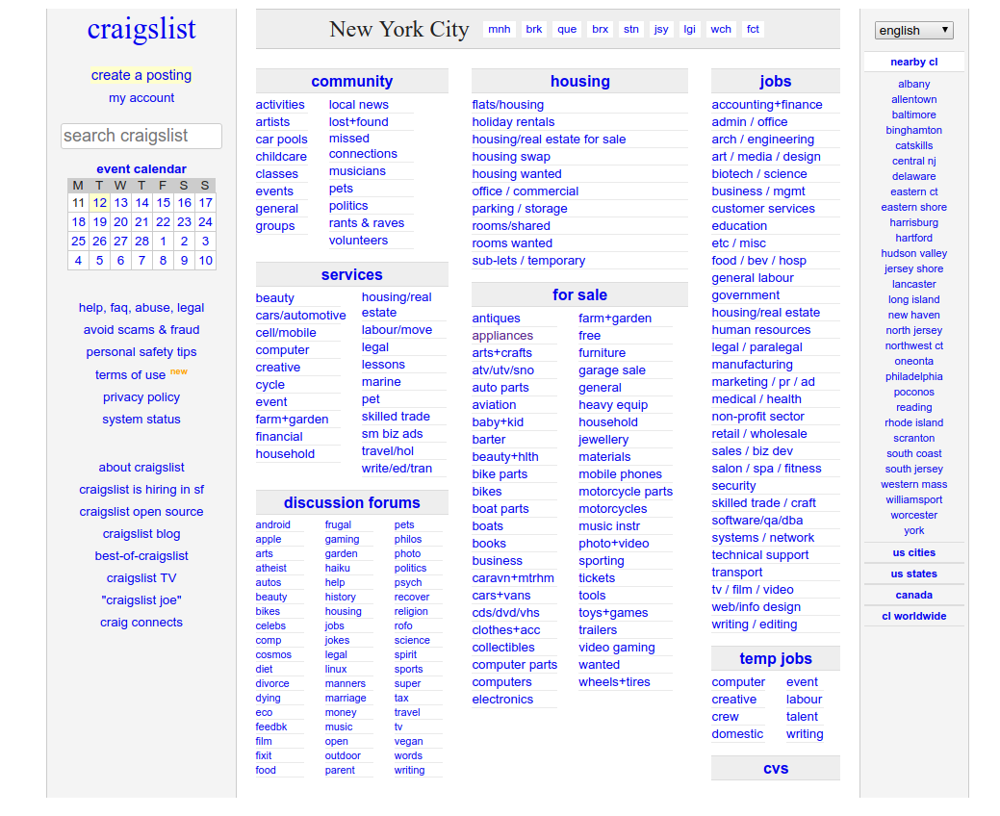
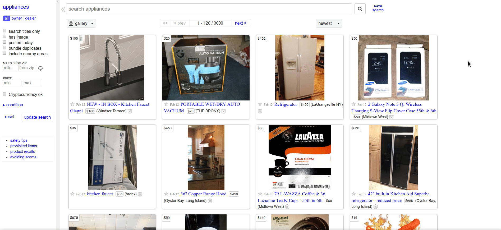
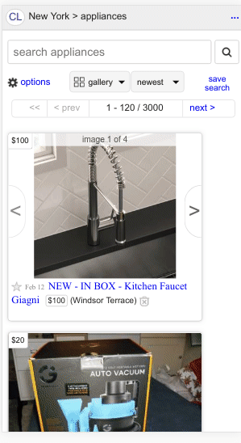
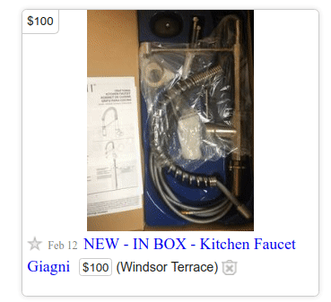
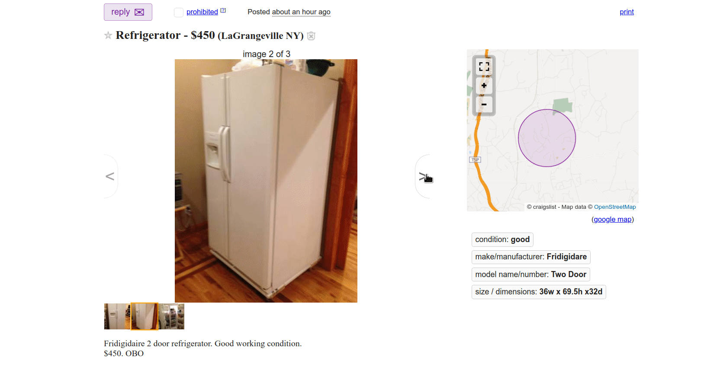
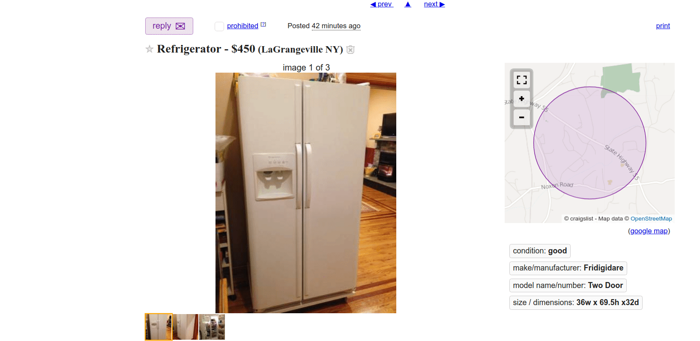
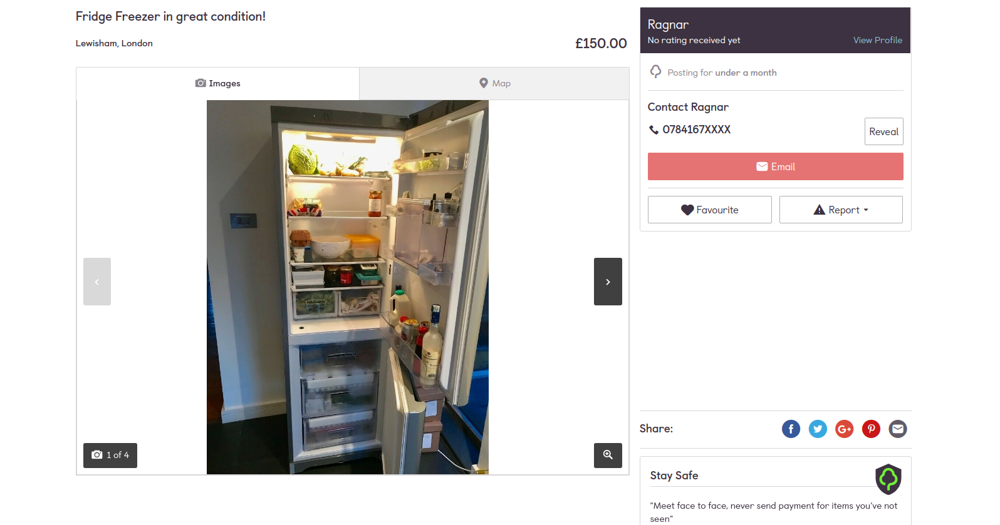

Muhammad Adistya Azhar
05111640000103
IMK - A

#HCI Homework 

## Small introduction to HCI

Human Computer Interaction (HCI) is the study of how people interact with computers. HCI has three components: the *user*, *computer*, and *interaction*.

Let's have a look at the details of each components.

- **User**: an individual or collection of users working together to achieve a particular goal using the set technology
- **Computer**:  a technological device ranging from home-use computers to large scale enterprise systems. The device used doesn't need to have a computerized parts. e.g. a handle or lever.
- **Interaction**: the communication existing between stakeholders (user and computer).     It can be **Direct**, which means the user is controlling and operating a device, and to also act upon dialogs/ feedbacks provided by the device. Or **indirect**, the act of using sensors.

## Critiques of websites and appliances
###  1. Craiglist.com

**Intro:**
Craiglist is a website to advertise used items for sale or services. Advertisements includes but not limited to: furnitures, automotives, electronics, property and jobs. 

The reason I chose craiglist as an example is because advertisement platforms are accessed daily by society. Society in general prefers to consume cheaper items in good condition rather than buy a new state at a costly expense. Therefore, it would be worthwile to analyse my experience browsing the site, and put myself in the perspective of a future buyer.

**These are my analysis:**

The first time I open the site, I was greeted by a white dull page, with a *Craiglist* logo on top, a world map below it, and list of cities at the bottom. A new user will be overwhelmed by the amount of hard to read text presented on the screen. I believe there are redundant sections that can be improved.

**Redundant sections:**
1. The world map doesn't really serve a purpose. In this context (advertisement platforms), a map's function is meant to provide details to the user the location of items for sale. It is used to calculate the route between your location and the seller's location. These are things that influences whether a buyer will re-decide to buy. So if you see that the seller is living at a good distance away, you may aswell find another seller closer to your place. 
 I tried clicking the map a few times to see its response. Unfortunately, it does nothing. I have concluded that the map may be used to pin point your location, so you'll be redirected to the right website according to your city/ country. (Shown on *Image 1.1*)

2. The list of cities may look complete, but trying to find your city is tiresome. The text is small, it is prone to accidental click on other cities, and it's all listed on one page, which means it's a long scroll down.
   My suggestion is to facilitate a "city search bar". So it'll allow users to search through the cities quickly and easily. (Shown on *Image 1.3*)
3. The website is lacking a navigation bar. A navigation bar is a must on modern websites to provide painless efforts navigating to different sections.

****

*Image 1.1: Craiglist landing page*
****

*Image 1.2: List of cities*
****

*Image 1.3: Scrolling through landing page*
****

4. On a chosen city (New York City), the page shows the categories that Craiglist provides. It's good they've atleast grouped it according to similarities, but it'll be much better to make it compact. The current version is the same as the list of cities, it is all shown as one page. On the other hand, we are provided with a search bar on the left side. Functionality wise, it's okay. (*Image 1.4*)
My suggestion is to re-position the search bar at the top with a larger size and a search button (example *Image 1.5*), so it is easily noticeable.

****

*Image 1.4: List of categories*
****

*Image 1.5: Gumtree search bar and categories*
****

*Image 1.6: Scrolling through ads*
****
5. Clicking on the "appliances" category takes me to a page filled with advertisements. To be honest I'm impressed with the setup. There are a few things that caught my attention. (1) The advertisements are laid out using a grid structure, where each product is wrapped in a card-like design. A row consists of 4 advertisements. (2) On mobile mode, the advertisements are stacked on top of each other. (*Image 1.7*) 
(3) Can view images of the advertisement by clicking next/ prev icon. This ensures users will save their time saved, rather than opening a new page just to view its images. (*Image 1.8*)
However, the page did took some time to load because it's filled with 120 products + pictures. Unfortunately, there is no option to filter the amount of products shown. It would be better to lower the amount of products shown on each page (20, 30, ... so on), with a quantity filter added.

****

*Image 1.7: Mobile mode*
****

*Image 1.8: View images*
****
1. The most important aspect of platforms like *Craiglist* is how the advertisement/ product is served to the user. This can be in terms of the details provided, pricing, seller infos, location etc. I clicked on a "Refrigerator" ad. As you can see, there is barely any information. In my opinion, things can be improved in various ways. 
(1) Add a section for seller's info - phone number, email etc. There is a "reply" button, which I assume is the method to get in touch with the seller, although it gave me a negative response. I'm also unable to know the reason of the error. (*Image 1.9b*) 
(2) Have a seperate price label, not concatenated on the title. 
(3) Put borders on each section, so users will be able to differentiate the description, title, location etc. An example is the Gumtree ad (*Image 1.9c*)
****

*Image 1.9a: Advertisement detail*
****

*Image 1.9b: Advertisement contact error*
****

*Image 1.9c: Example of a Gumtree advertisement*
****

**Conclusion:**
To summarise things, *Craiglist* have many aspects that needs to be improved if they want to be able to compete with other platforms. The way advertisements are shown, color schemes and content layout are still inadequate. At the end of the day, putting myself in the perspective of a future buyer has failed to reach its goal - which was to get in contact with the seller to ask and buy the item.

### 2. todo

### 3. todo

## References:
*A. D., J. F., G. D., & R. B. (2004). Human–Computer Interaction (3rd ed.).*
*M. J. Introduction to HCI. Retrieved February 13, 2019, from https://www.cs.bham.ac.uk/~rxb/Teaching/HCI II/intro.html*
*Craiglist. Retrieved February 13, 2019, from craiglist.org*
*Gumtree | Free classified ads from the #1 classifieds site ...  Retrieved February 13, 2019, from https://www.gumtree.com/*