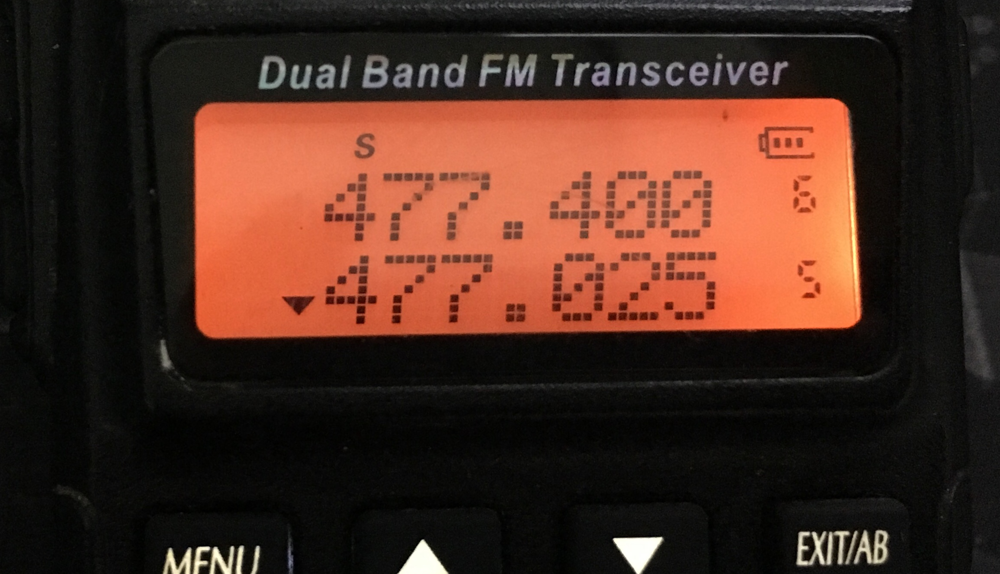

Muhammad Adistya Azhar

05111640000103

IMK - A

# HCI Homework 

## Contents

- [HCI Homework](#hci-homework)
  - [Contents](#contents)
  - [Small introduction to HCI](#small-introduction-to-hci)
  - [Critiques of websites and appliances](#critiques-of-websites-and-appliances)
    - [1. Craiglist.com](#1-craiglistcom)
    - [2. Baofeng UV82 Radio](#2-baofeng-uv82-radio)
    - [3. Epson L350 Printer](#3-epson-l350-printer)
  - [References](#references)

## Small introduction to HCI

Human Computer Interaction (HCI) is the study of how people interact with computers. HCI has three components: the *user*, *computer*, and *interaction*.

Let's have a look at the details of each components.

- **User**: an individual or collection of users working together to achieve a particular goal using the set technology
- **Computer**:  a technological device ranging from home-use computers to large scale enterprise systems. The device used doesn't need to have a computerized parts. e.g. a handle or lever.
- **Interaction**: the communication existing between stakeholders (user and computer).     It can be **Direct**, which means the user is controlling and operating a device, and to also act upon dialogs/ feedbacks provided by the device. Or **indirect**, the act of using sensors.

## Critiques of websites and appliances
###  1. Craiglist.com

**Intro:**
Craiglist is a website to advertise used items for sale or services. Advertisements includes but not limited to: furnitures, automotives, electronics, property and jobs. 

The reason I chose craiglist as an example is because advertisement platforms are accessed daily by society. Society in general prefers to consume cheaper items in good condition rather than buy a new state at a costly expense. Therefore, it would be worthwile to analyse my experience browsing the site, and put myself in the perspective of a future buyer.

**These are my analysis:**

The first time I open the site, I was greeted by a **white dull** page, with a *Craiglist* logo on top, a world map below it, and list of cities at the bottom. A new user will be **overwhelmed** by the amount of **hard to read text** presented on the screen. I believe there are redundant sections that can be improved.

**Redundant sections and its solutions:**
1. The world map doesn't really serve a purpose. In this context (advertisement platforms), a map's function is meant to provide details to the user the location of items for sale. It is used to calculate the route between your location and the seller's location. These are things that influences whether a buyer will re-decide to buy. So if you see that the seller is living at a good distance away, you may aswell find another seller closer to your place. 
 I tried clicking the map a few times to see its response. Unfortunately, it does nothing. I have concluded that the map may be used to pin point your location, so you'll be redirected to the right website according to your city/ country. (Shown on *Image 1.1*)

****

*Image 1.1: Craiglist landing page*
****

2. The list of cities may look complete, but trying to find your city is **tiresome**. The text is **small**, it is **prone** to accidental click on other cities, and it's all listed on one page, which means it's a **long** scroll down.
My suggestion is to facilitate a "**city search bar**". So it'll allow users to search through the cities **quickly** and **easily**. (Shown on *Image 1.2 and 1.3*)

****

*Image 1.2: List of cities*
****

*Image 1.3: Scrolling through landing page*
****

3. The website is **lacking** a navigation bar. A navigation bar is a must on modern websites to provide **painless efforts** navigating to different sections.

4. On a chosen city (New York City), the page shows the categories that Craiglist provides. It's good they've atleast **grouped** it according to similarities, but it'll be much better to make it **compact**. The current version is the same as the list of cities, it is all shown as one page. On the other hand, we are provided with a search bar on the left side. Functionality wise, it's okay. (*Image 1.4*)
My suggestion is to **re-position** the search bar at the **top** with a **larger size** and a **search button** (example *Image 1.5*), so it is easily **noticeable**.

****

*Image 1.4: List of categories*
****

*Image 1.5: Gumtree search bar and categories*
****
5. Clicking on the "appliances" category takes me to a page **filled** with advertisements. To be honest I'm **impressed** with the setup. There are a few things that caught my attention. 
(1) The advertisements are laid out using a **grid structure**, where each product is **wrapped** in a card-like design. A row consists of 4 advertisements. (*Image 1.6*)
(2) On mobile mode, the advertisements are **stacked** on top of each other. (*Image 1.7*) 
(3) Can **view** images of the advertisement by clicking next/ prev icon. This ensures users will have their **time saved**, rather than opening a new page just to view its images. (*Image 1.8*)
However, the page did take some **time to load** because it's **filled** with **120 products + pictures**. Unfortunately, there is no option to filter the amount of products shown. It would be better to **lower the amount of products** shown on each page (20, 30, ... so on), with a **quantity filter** added.

****

*Image 1.6: Scrolling through ads*
****

*Image 1.7: Mobile mode*
****

*Image 1.8: View images*
****
6. The most important aspect of platforms like *Craiglist* is how the advertisement/ product is served to the user. This can be in terms of the details provided, pricing, seller infos, location etc. I clicked on a "Refrigerator" ad. As you can see, there is **barely** any information. (*Image 1.9a*) In my opinion, things can be improved in various ways. 
(1) Add a section for seller's info - phone number, email etc. There is a "reply" button, which I assume is the method to get in touch with the seller, although it gave me a **negative response**. I'm also unable to know the reason of the error. (*Image 1.9b*) 
(2) Have a **seperate** price label, **not concatenated** on the title. 
(3) Put **borders** on each **section**, so users will be able to **differentiate** the description, title, location etc. An example is the Gumtree ad (*Image 1.9c*)
****

*Image 1.9a: Advertisement detail*
****

*Image 1.9b: Advertisement contact error*
****

*Image 1.9c: Example of a Gumtree advertisement*
****

**Conclusion:**
To summarise things, *Craiglist* have many aspects that need to be improved if they want to be able to **compete** with other platforms. The way advertisements are shown, color schemes and content layout are still **inadequate**. At the end of the day, putting myself in the perspective of a future buyer has **failed** to reach its goal - which was to get in contact with the seller to ask and buy the item.

### 2. Baofeng UV82 Radio

**Intro:**

Baofeng UV82 is a Chinese made two-way radio (walkie talkie) with a slim design to fit in the hand of its users. This radio is popular for personal and commercial use because it has an affordable price packed with interesting features.

The reason I chose this device was because Chinese made products have been famous to compete in the tech industry with such an affordable price. I would like to see if the quality and experience of this device is worth of its value.

This test will be comprised of: 
(1) Setting, scanning and switching through frequencies.
(2) Voice transmission.
(3) Keypad functionality.

**These are my analysis:**

On power up, a **beep tone** and Welcome **logo** is shown. After that, it flashes away and we are taken to the frequency screen.

**Problems and its solutions**:

1. If we want to input a specific frequency we have to **manually** type the numbers or **scroll** up-down. There are two modes; Saved Frequencies (*Image 2.1a*) and Free Frequencies (*Image 2.1b*). This won't work if your **mode** is set to **Saved Frequencies** as it will only show saved frequencies. This can be confusing to new users, because on the LCD screen, there is no label to show what mode we are in. Both mode do show the same display.
To change modes, we have to restart the device while pressing a **hotkey**. This is stated in the manual book. An **improved design** would be to have a **mode button** on the keypad. A **press** of the button will allow the radio to change **modes** without restarting. **Restarting** the device may cause important conversations to be **missed**.
****

*Image 2.1a: LCD view of Saved Frequencies Mode.*
****

*Image 2.1b: LCD view of Free Frequencies Mode.*
****
2. To talk or transmit our voice, there is a **push-to-talk button** (PTT) on the left side. The mechanism of this button is unusual. Buttons are usually pressed for it to work. This PTT button cannot be pressed on the middle. We have to **press** it on the **upper** or **lower** edges. The reason of this design is because the radio has Dual Frequency watch feature which allows the user to set two frequencies at a time. We can see it on the display there are two frequencies. Pressing the upper button will transmit on the top frequency, and lower button will transmit on the bottom frequency. This can be annoying at times if we accidently pressed the wrong edge, because our voice will not be transmitted on the frequency we want. So miscommunication amongs radio-ers will happen. My solution would be to remove the upper-lower click, and have a normal middle click button. (*Image 2.2*)
****

*Image 2.2: Side view of the radio shows PTT buttons. PTT-A is upper and PTT-B is lower.*
****
3. Each key on the keypad represents a number and an abbreviation. The abbreviation corresponds to a feature. However, the abbreviation is impossible to understand, and the way to activate it is clueless. My solution would be to remove the abbreviation and just have a menu screen to accomodate activating features.
****

*Image 2.3: Side view of the radio shows PTT buttons. PTT-A is upper and PTT-B is lower.*
****

**Conclusion:**
The baofeng has many unlabelled parts which causes users to be confused.

**Watch Video Here:**
**[Video Link](https://youtu.be/axthqHbDRRg)**

### 3. Epson L350 Printer

**Intro:**
Epson L350 is a multi functional printer with print, scan and photocopy capabilities.

In this test, my friend Farras Rabbani tries to photocopy a brochure.

**These are my analysis:**
There are various buttons with unfamiliar logos. We cannot differentiate which one is for print, scan or photocopy.

**Problems and its solutions:**
1. The foreign logos on the buttons caused my friend to blatantly try each one of them, and hopes for the best result.
I think the manafucturer should atleast add a label below the buttons - as not everyone understand logos. (*Image 3.1*)

****

*Image 3.1: The buttons on the printer.*
****

**Conclusion:**
The printer has a simple interface and design. But too simple caused confusion for Farras.

**Watch Video Here:**
**[Video Link](https://youtu.be/Hm6eT8Rezio)**

## References
- *A. D., J. F., G. D., & R. B. (2004). Human–Computer Interaction (3rd ed.).*
- *M. J. Introduction to HCI. Retrieved February 13, 2019, from https://www.cs.bham.ac.uk/~rxb/Teaching/HCI II/intro.html*
- *Craiglist. Retrieved February 13, 2019, from craiglist.org*
- *Gumtree | Free classified ads from the #1 classifieds site ...  Retrieved February 13, 2019, from https://www.gumtree.com/*
- *BaoFeng Radio Inc. BaoFeng Radios. Retrieved February 13, 2019, from https://baofengtech.com/uv82*
- *Epson L350 All-in-One Printer. Retrieved February 14, 2019, from https://epson.com.jm/For-Home/Printers/Inkjet/Epson-L350-All-in-One-Printer/p/C11CC26201*